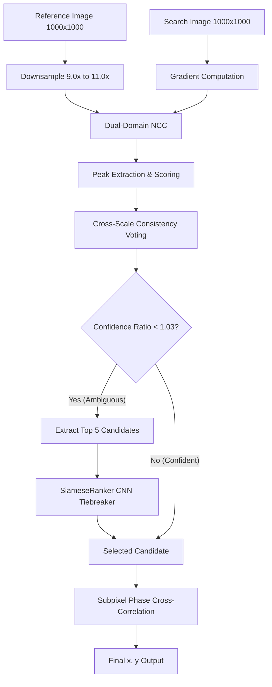
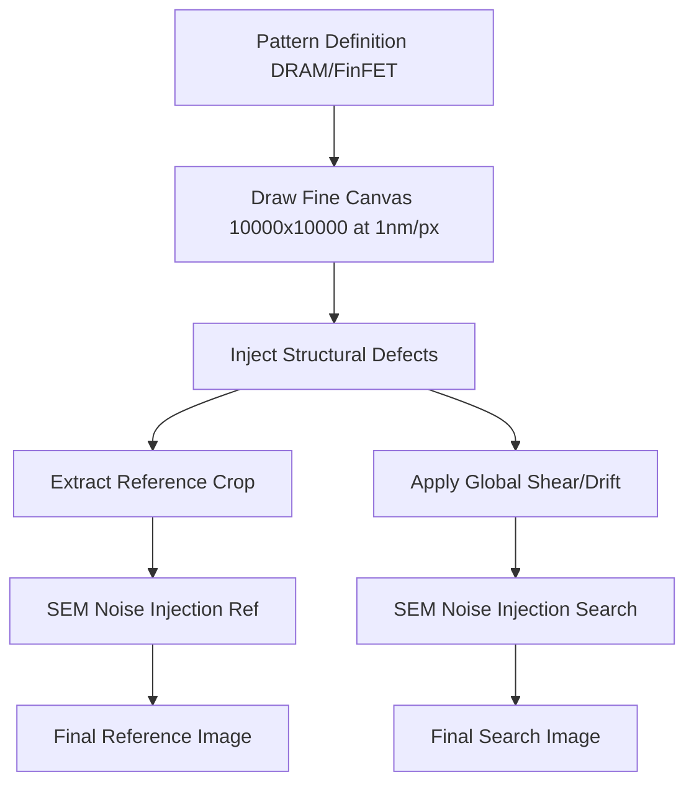

# Drift-Sense: System Architecture

## Core Modules & Directory Structure

```text
Semicon1/
├── localize.py              # Main Entry Point (Inference API)
├── benchmark.py             # Evaluation harness
├── siamese_net.py           # PyTorch Siamese Ranker
├── generate_dataset.py      # Dataset generation CLI
├── generate_triplets.py     # Offline ML data generation CLI
├── train_offline.py         # AI Trainer
├── src/                     # Physics Simulation Library
│   ├── pipeline.py          # Master orchestrator for generating images
│   ├── sem_imaging.py       # SEM degradations (noise, charging, blur)
│   ├── presets.py           # DRAM / FinFET config parameters
│   └── patterns/            # Math-based pattern drawing
│       ├── dram.py
│       ├── finfet.py
│       └── zones.py
└── weights/                 # Model Checkpoints (.pth, .onnx)
```

## Data Flow (Inference - `localize.py`)



## Data Flow (Training Data Pipeline)



## Service Boundaries
Since this is a standalone CLI tool, there are no microservices or web API boundaries.
- **Physics Layer (`src/`)**: Entirely decoupled from ML and inference. Only handles synthetic data generation.
- **ML Layer (`siamese_net.py`, `train_offline.py`)**: Responsible for embeddings and model training.
- **Inference Layer (`localize.py`)**: Consumes the output of the Physics Layer (during testing) and the ML Layer (for tiebreaking). Designed to operate entirely independently of PyTorch if `--no-ai` is passed or weights are missing.

## AI/ML Pipeline
1. **TinyEncoder**: 4-layer CNN (Conv2D -> BatchNorm -> ReLU) -> AdaptiveAvgPool2d(1) -> Flatten.
2. **Embedding**: Outputs a 128-dim L2-normalized vector.
3. **Similarity**: Cosine similarity via dot product.
4. **Loss**: Triplet Margin Loss (`max(0, margin - sim(anchor, pos) + sim(anchor, neg))`).
5. **Deployment**: Saved as `.pth`, loadable into PyTorch.

## External Integrations
None. The code is hermetically sealed to run entirely on the judges' machine without internet access.
